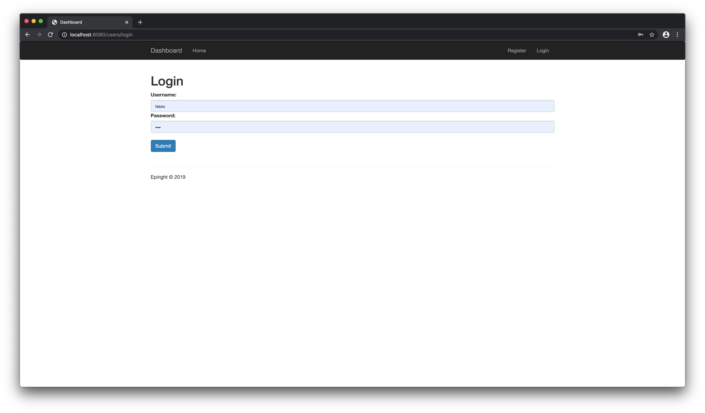
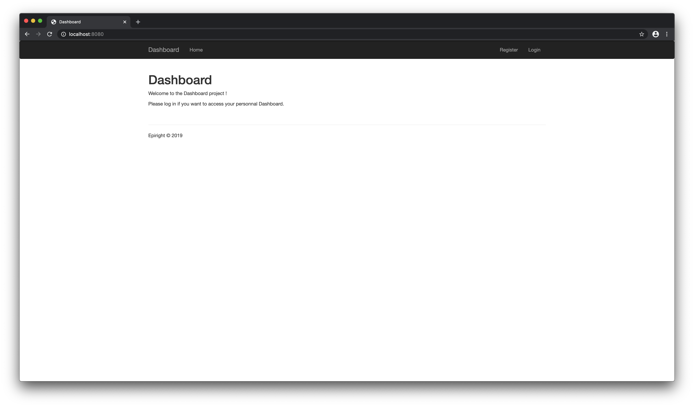
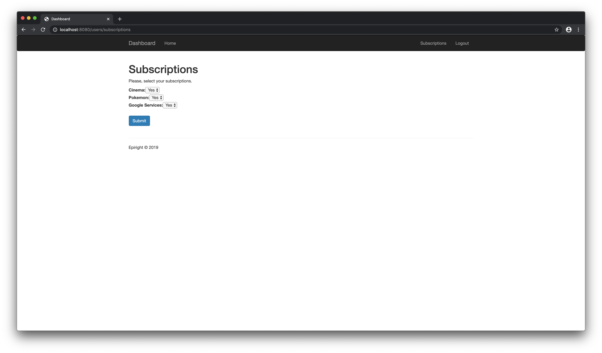

# DEV_dashboard_2019
3rd year project in Javascript in which the goal is to create a local web application dashboard that users can customize.
First of all the user needs to register to the application in order to obtain an account and can then authenticate.
Each users are stored in a data base with the help of "MongoDB" providing a user management module. Then they can independently subscribe and manage their own services (total 3). All services offers configurable widgets (total 6), so the users can insert instances of it thus composing their dashboard. Additionaly the user can move, delete, resize and reconfigure the widgets instances if needed. The widgets displays any kind of informations (weather widgets, pokemon widgets etc...) and are regularly refreshed with a timer.  
The architecture of the web application is based on MERN stack, using "Express.js" framework to handle the widgets API's requests and front end views, "MongoDB" to store + manage users, "React" framework for the user client interface and "node.js" for the back end that process client datas and launches client browser.
The web application is deployed with help of "Docker Compose", docker_compose.yml uses the docker service server to launch the application on port 8080 thus answering the call http://localhost:8080/about.json.

PREREQUISITE :

    - Javascript + node.js + Docker must be installed.
    
    - cd login && npm install ; .. && cd weather-app && npm install.

USAGE :

    1) docker-compose up --build or 1) node login/app.js
    
    2) copy and paste http://localhost:8080/ on any browser
    
To test independently the widget : 

    1) cd weather-app && npm start
    
    

